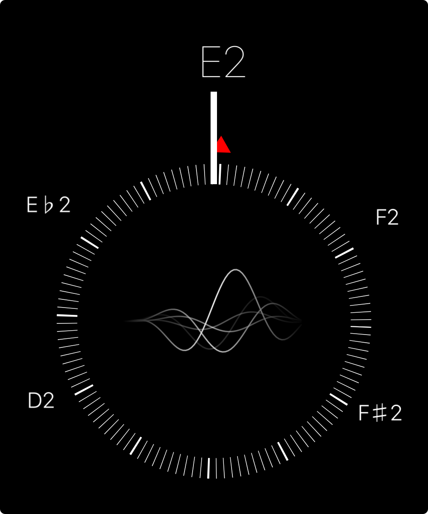

# Guitar Tuner for iOS

This repository hosts the result of a four-part series on Fourier transform that
I wrote at
[elsl.ooo](https://elsl.ooo/2016/02/12/digital-tuner-ios-swift.html).

## Requirements

- [AudioKit](http://audiokit.io) 2.x
- ARC
- [CocoaPods](https://cocoapods.org)
- Swift 3.0

## Installing

Run the following commands:

    git clone https://github.com/timvanelsloo/guitar-tuner
    cd guitar-tuner

Then, make sure you have [CocoaPods](https://cocoapods.org) installed and run
the following two commands.

    pod install
    open Tuner.xcworkspace

## Author

Tim van Elsloo, [elsl.ooo](https://elsl.ooo)

## License

The Guitar Tuner app is licensed under MIT so you can use it for anything you
like as long as you add a copy of the license to the acknowledgements.
